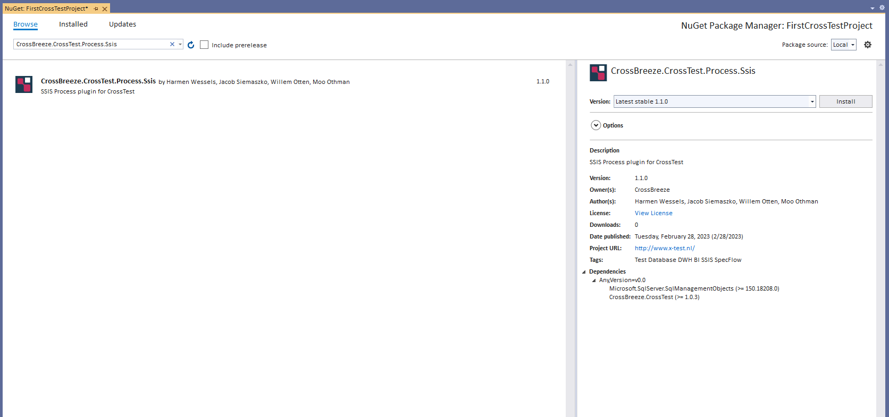

# Config documentation for CrossTestConfig

## CrossTest
The CrossTest configuration to configure all information needed for the steps to execute.

In order to use this service you must install the NuGet package CrossBreeze.CrossTest


Make sure the following section node has been added to the configSections of your App.config
```xml
<configSections>
		<section name="crossTest" type="CrossBreeze.CrossTest.SpecFlow.Configuration.CrossTestConfig, CrossBreeze.CrossTest.SpecFlow.Core" />
</configSections>
```
### Example
```xml
<CrossTest>
    <test>...</test>
    <database>...</database>
</CrossTest>
```

### Attributes
| Attribute            | Type                 | Description                               |
|:---                  |:---                  |:---                                       |

### Config elements
| Config element        | Type                                                     | Description                  | Collection | Item name                 |
|:---                   |:---                                                      |:---                          |:---        |:---                       |
| test    | [TestConfig](../TestConfig)               | Configuration of test specifics such as default values, naming conventions etc    | No         |                           |
| database    | [DatabaseConfig](../DatabaseConfig)               | Database configurations    | No         |                           |

## CrossTestSsis
The CrossTestSsis configuration to configure all information needed for the steps to execute.

In order to use this service you must install the NuGet package CrossBreeze.CrossTest.Process.Ssis


Make sure the following section node has been added to the configSections of your App.config
```xml
<configSections>
		<section name="crossTestSsis" type="CrossBreeze.CrossTest.Process.Ssis.Configuration.SsisProcessesConfig, CrossBreeze.CrossTest.Process.Ssis" />
</configSections>
```

### Example
```xml
<CrossTestSsis>
    <SsisProcesses>...</SsisProcesses>
</CrossTestSsis>
```

### Attributes
| Attribute            | Type                 | Description                               |
|:---                  |:---                  |:---                                       |

### Config elements
| Config element        | Type                                                     | Description                  | Collection | Item name                 |
|:---                   |:---                                                      |:---                          |:---        |:---                       |
| SsisProcesses    | [SsisProcessProjectConfig](../SsisProcessConfig)               | A list of process configurations that can be used in test scenario's.    | Yes         |                           |


## CrossTestAdf
The CrossTestAdf configuration to configure all information needed for the steps to execute.

In order to use this service you must install the NuGet package CrossBreeze.CrossTest.Process.Adf


Make sure the following section node has been added to the configSections of your App.config
```xml
<configSections>
		<section name="crossTestAdf" type="CrossBreeze.CrossTest.Process.Adf.Configuration.AdfProcessesConfig, CrossBreeze.CrossTest.Process.Adf" />
</configSections>
```

### Example
```xml
<CrossTestAdf>
    <AdfProcesses>...</AdfProcesses>
</CrossTestAdf>
```

### Attributes
| Attribute            | Type                 | Description                               |
|:---                  |:---                  |:---                                       |

### Config elements
| Config element        | Type                                                     | Description                  | Collection | Item name                 |
|:---                   |:---                                                      |:---                          |:---        |:---                       |
| AdfProcesses    | [AdfProcessConfig](../AdfProcessConfig)               | A list of process configurations that can be used in test scenario's.    | Yes         |                           |