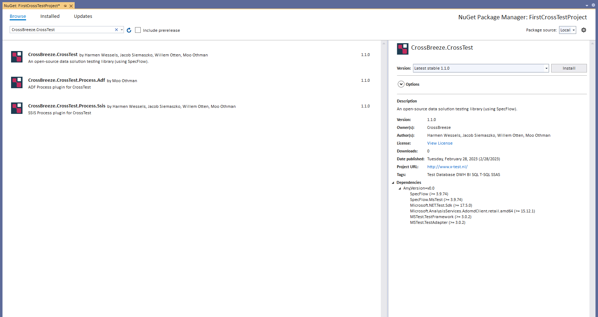

# Configuration

CrossTest has several configuration options depending on the used package. This reference lists all configuration options, per package below.


## CrossBreeze.CrossTest
In order to use the core of CrossTest you must install the NuGet package CrossBreeze.CrossTest


Make sure the following section element has been added to the configSections of your App.config
```xml
<configSections>
    ...
    <section name="crossTest" type="CrossBreeze.CrossTest.SpecFlow.Configuration.CrossTestConfig, CrossBreeze.CrossTest.SpecFlow.Core" />
</configSections>
```

The starting point of the configuration is [CrossTestConfig](./CrossTestConfig).


## CrossBreeze.CrossTest.Process.Ssis
In order to use Microsoft SQL Server Integration Services processes from within CrossTest you must install the NuGet package CrossBreeze.CrossTest.Process.Ssis.


Make sure the following section node has been added to the configSections of your App.config
```xml
<configSections>
    ...
    <section name="crossTestSsis" type="CrossBreeze.CrossTest.Process.Ssis.Configuration.crossTestSsisConfig, CrossBreeze.CrossTest.Process.Ssis" />
</configSections>
```

The starting point of the SSIS configuration is [crossTestSsisConfig](./crossTestSsisConfig.md).


## CrossBreeze.CrossTest.Process.Adf
In order to use Azure Data Factory (ADF) processes from within CrossTest you must install the NuGet package CrossBreeze.CrossTest.Process.Adf.


Make sure the following section node has been added to the configSections of your App.config
```xml
<configSections>
		<section name="crossTestAdf" type="CrossBreeze.CrossTest.Process.Adf.Configuration.AdfProcessesConfig, CrossBreeze.CrossTest.Process.Adf" />
</configSections>
```

The starting point of the ADF configuration is [crossTestAdfConfig](./crossTestAdfConfig.md).