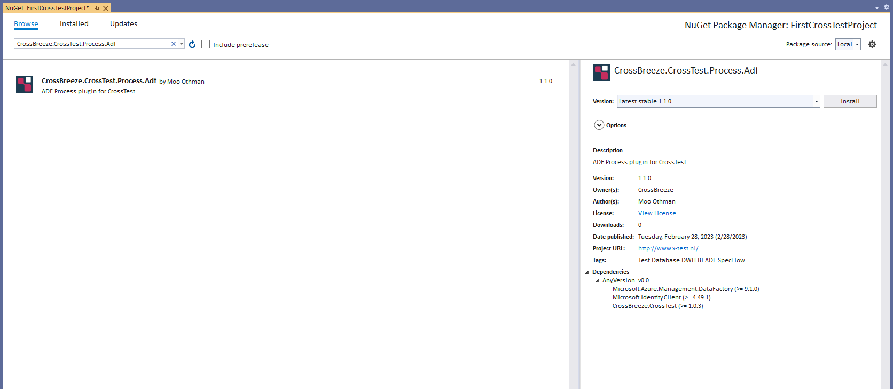

# Configuration

CrossTest has several configuration options. This reference lists all configuration options, categorized by purpose.

<!-- The reference starting point is [CrossTestConfig](./CrossTestConfig). -->
In order to use the service of Database you must install the NuGet package CrossBreeze.CrossTest

In order to use the service of SSIS you must install the NuGet package CrossBreeze.CrossTest.Process.Ssis

In order to the service of ADF you must install the NuGet package CrossBreeze.CrossTest.Process.Adf
