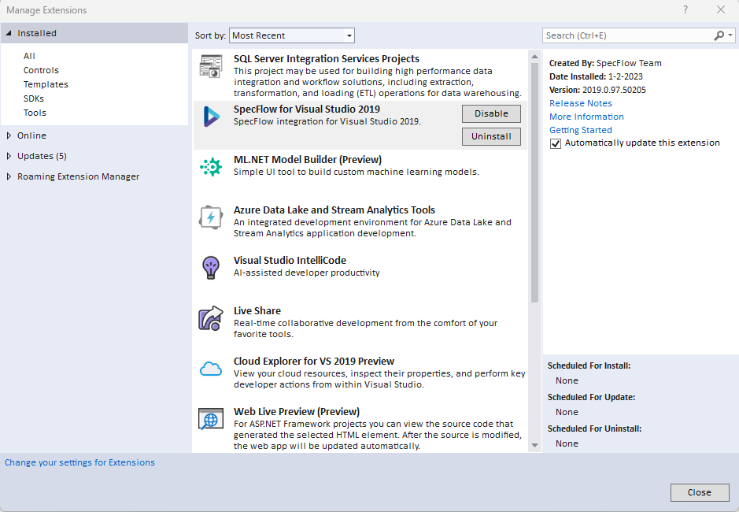
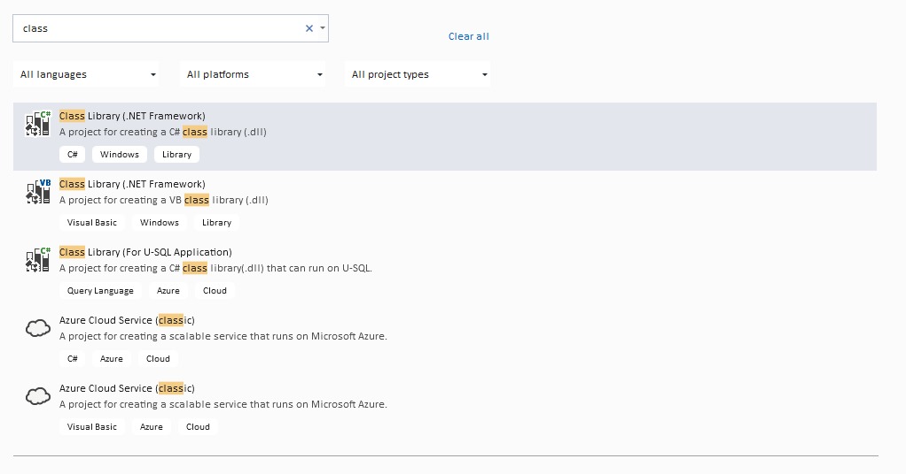
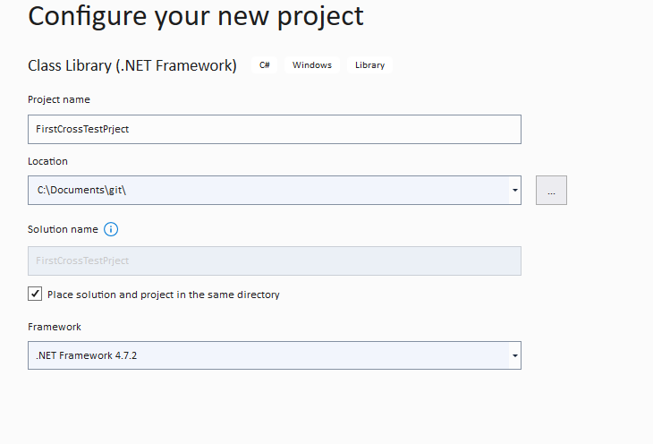
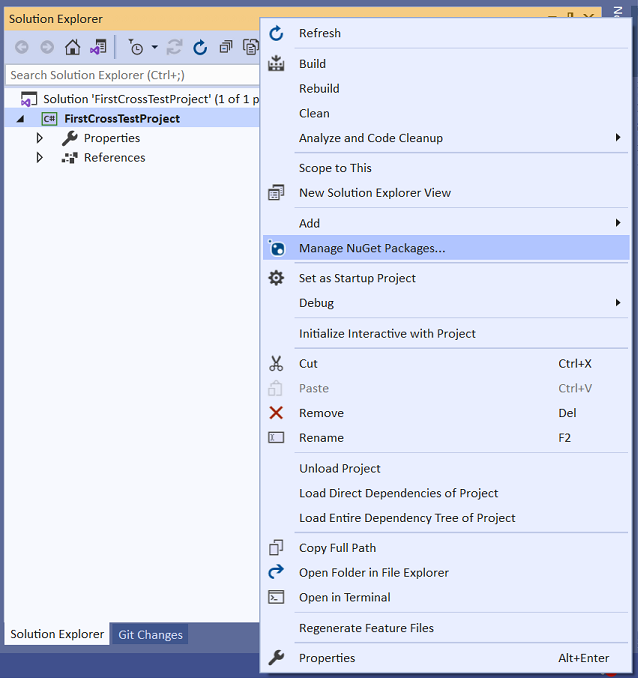
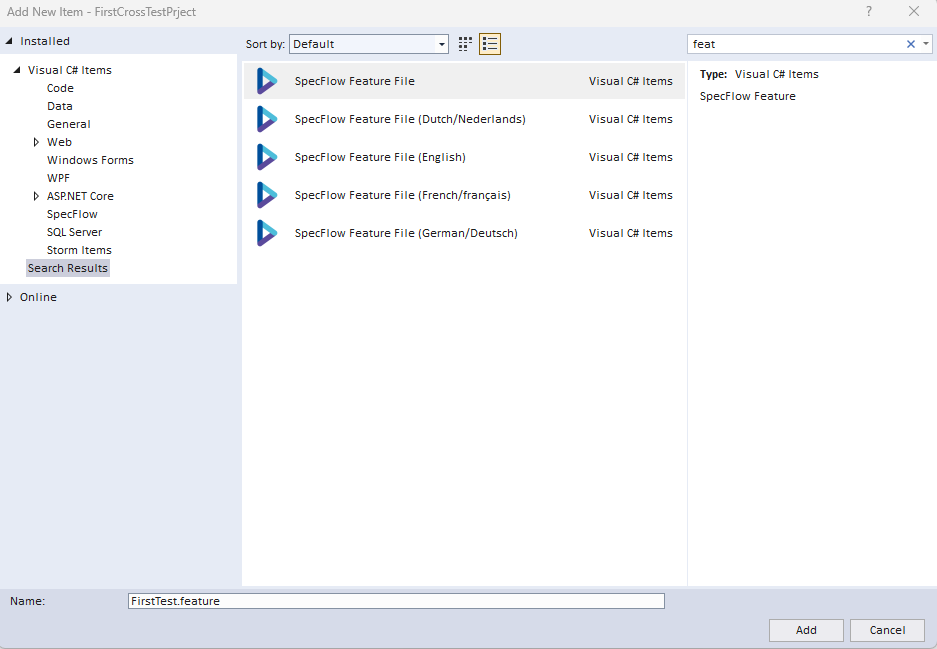
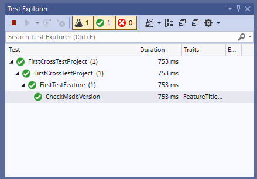
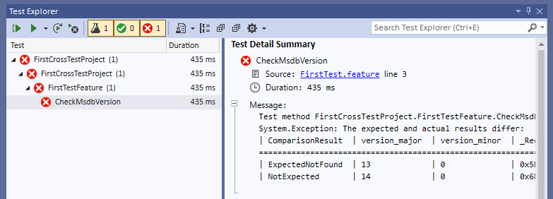
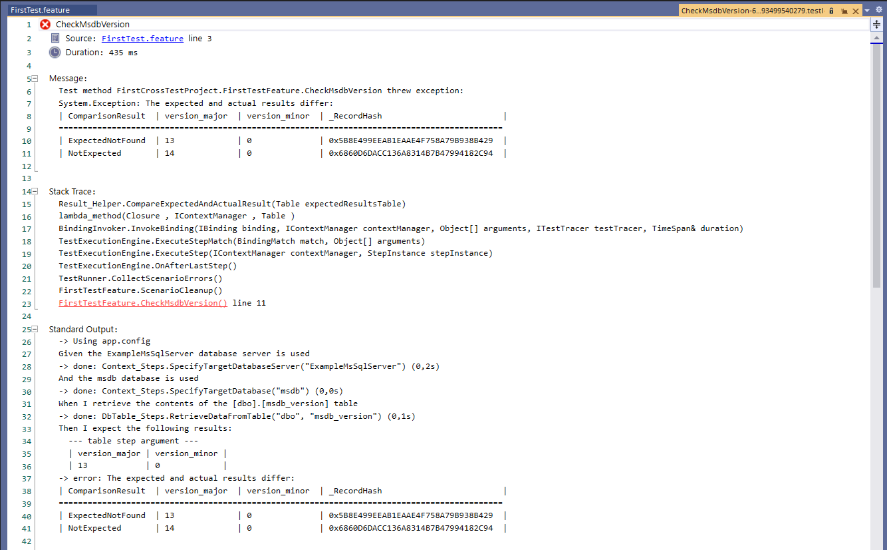

# Getting started

On this wiki you will find all needed documentation to get started with CrossTest.

[//]: #(test met comment)

## How to get CrossTest
CrossTest is available as a [NuGet package](https://www.nuget.org/packages/CrossBreeze.CrossTest/).
If you are new to NuGet, please see the Microsoft documentation on [how to install NuGet packages](https://docs.microsoft.com/en-us/nuget/consume-packages/ways-to-install-a-package).
When you want to setup a new testing project using CrossTest, follow the instructions on the remainder of this page.

## How to use CrossTest
In order to use CrossTest in your project, you need to include the CrossTest library in a Visual Studio C# Library project. The most convenient way to do so is by using the Visual Studio NuGet package manager.

### Install the Specflow for Visual Studio plugin
It is recommended to install the Specflow for Visual Studio plugin. This will make Visual Studio recognize Specflow files and enables auto completion, formatting and syntax highlighting.

To install the plugin:

 * In the main menu, go to [Tools] > [Extensions and Updates]. The 'Extentions and Update' screen will appear.
 * Now click on the 'Online' category en search for 'Specflow'.
 * Install the 'Specflow for Visual Studio &lt;your version&gt;' plugin.



### Create a Visual Studio project and include the NuGet package.
Create a new Visual Studio project of type Visual C# Class Library. After the project is created you can remove the default 'Class1.cs' file which is created.




Open the NuGet package manager on the newly created project.



Select the Browse tab, in the search field type 'CrossTest' and hit 'Enter' to find the appropriate package. Select the 'CrossBreeze.CrossTest' package and on the right side click the [Install] button. A summary window of what will be installed will be shown, click 'OK'. Then a license acceptance window will open for the different components, read the licenses and click 'I Accept' (if you do :nerd:). Now CrossTest and all its dependecies will be installed into the new project.


The CrossTest package and dependant packages have now been added to your project. After basic configuration you can create and run your first test.


You might have some more dependencies in your project, since Visual Studio adds some by default. In the screenshot you see the minimal dependecies needed for executing tests.

### Configure CrossTest
Before we can run our first test we need to setup basic configuration for CrossTest. 
For our first test, we only need to specify the proper Micosoft SQL Server connection string.
Open the App.config file in the project and add the `connectionStrings` and the `ExampleMsSqlConnection` key so it contains a valid connection string. In our example there is a database instance installed with the host 'localhost'.

```xml
<crossTest>
		<database>
			<!--Add-->
			<servers>
				<server name="ExampleMsSqlServer" connectionName="ExampleMsSqlConnection" type="MsSql" commandTimeout="10" />
			</servers>
		</database>
		<test>
		</test>
</crossTest>
<!--Add-->
<connectionStrings>
	<!-- Define the database servers to use. The name is the name of the server and the connection string should be without a database. -->
	<add name="ExampleMsSqlConnection" connectionString="Data Source={source};User Id={username};Password={password};" />
</connectionStrings>
```


This is all configuration needed for running the first test. For an explanation of all configuration options see the [Configuration](../Configuration/) section.

### Create and run your first test

Add a new Specflow Feature file to your project by right clicking on the project name, go to 'Add' and click on 'New item'. The window 'Add New Item' will appear as shown below.



Click on the 'Specflow Feature File', set the 'Name' to 'FirstTest.feature' and click 'Add'. Now a new feature file is created with a sample Specflow test. This test won't be able to execute because there are sentences used which are not implemented. Now we update the contents of the test to the following to use some CrossTest sentenses.

```
Feature: FirstTest

Scenario: Check msdb version
	# Make sure the ExampleMsSqlServer server is used.
	Given the ExampleMsSqlServer database server is used
	# Use the msdb database.
	And the msdb database is used
	# Get the data from the dbo.msdb_version table
	When I retrieve the contents of the [dbo].[msdb_version] table
	# Check whether the result of the table is as expected.
	Then I expect the following results:
		| version_major | version_minor |
		| 14            | 0             |
```

In this example we use the connection to a database server as defined in the App.config. We then use the 'msdb' database on that server, execute a function en check it results.

Now open the 'Test Explorer' window by going to the main menu, click on 'Test', then choose 'Windows' and click on 'Test Explorer'. If everything works you should now see the 'CheckMsdbVersion' test.


!!!tip
    If the test doesn't appear try to perform a rebuild on the C# project.

Now run the test by right clicking on the test and click on 'Run Selected Test'. If your SQL Server version is 2017 the test will probably succeed and the test should turn green.



If the test fails (or you make it fail by changing the expected version :smile:) you will see the test will turn red and more information will be shown in the test detail window (below or on the right of the test overview).



To get a more readable version of the output, click on the 'Output' link (in blue) at the bottom of the message. This will open the 'Test Output' window.


!!!tip
    By default the output of the test is shown in a smooth font (not all characters have the same width). To make the output even more readable you can choose a font where all characters have the same width, like 'Courier New'. To do this in the main menu go to 'Tools', click on 'Options'. In the 'Options' screen in the 'Environment' category choose 'Font and Colors'. Now at 'Show settings for' choose 'Environment and for the 'Display items' choose 'Plain text'. Now you can change the 'Font' to for example 'Consolas' or 'Courier New' and click 'OK' (all fixed-width fonts are bold in the drop-down).
    
    Sadly this will also change the font for almost any menu and window. If you also think this should be a seperate setting in Visual Studio, please vote for it on the following page: [Test explorer UI font](https://developercommunity.visualstudio.com/content/problem/208608/test-explorer-ui-font.html).

    A workaround, to changing the font, is to right click in the output window and choose 'Copy all' and then paste the output in a simple editor like Notepad++.

## Execute processes
Within CrossTest there is support for executing different types of processes, like ETL processes. We have implemented add-ons for CrossTest to execute Microsoft SQL Server Intgeration Services and Azure Data Factory processes. For details on how to configure these add-ins, please see the [Configuration](./Configuration/index.md) section.

If you want to execute SSIS packages might also need the 'Microsoft.SqlServer.Diagnostics.Strace' reference as a dependency in your C# project.

## Bugs & issues
When you encounter an issue while using CrossTest please report it by sending an e-mail to [info@x-breeze.com](mailto:info@x-breeze.com?SUBJECT=CrossTest%20Specflow%20-%20Bug%20report) with the subject 'CrossTest Specflow - Bug report'.

Please provide the following information:

- Steps to reproduce
- Expected behaviour
- CrossTest version used
